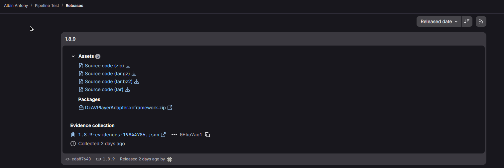

# GitLab Generic Package Registry

This repository demonstrates how to interact with the [GitLab Generic Package Registry](https://docs.gitlab.com/ee/user/packages/generic_packages/). It contains a Bash script to easily upload files (or entire directories) into the registry.

## Contents

- `upload.sh`: A script that automates uploading files to a project's generic package registry via the GitLab API.
- `image.png`: Sample image for demonstration.

## Installation

Ensure the upload script has execution permissions:
```bash
chmod +x upload.sh
```

## Basic Usage

### Uploading Files

The `upload.sh` script currently accepts a target path (file or directory) as the first parameter. It will read missing details like tokens and package names from environment variables or use the embedded defaults.

**1. Upload a single file:**
```bash
./upload.sh path/to/file.txt
```

**2. Upload all files within a directory:**
```bash
./upload.sh path/to/directory
```

### Configuration Variables

You can configure the behavior either by editing the variables inside `upload.sh` directly, or by passing standard environment variables:

| Variable | Description | Default inside script |
| :------- | :---------- | :-------------------- |
| `PRIVATE_TOKEN` | Your GitLab Personal Access Token. | `<access_token>` |
| `GITLAB_PROJECT_ID` | The target GitLab project ID. | `24` |
| `PACKAGE_NAME` | The generic package name. | `my_package` |
| `PACKAGE_VERSION` | The version to assign to the uploading artifacts. | `1.0.0` |
| `GITLAB_URL` | Base URL for your GitLab instance. | `https://gitlab.example.com` |

Example usage with inline environment overrides:
```bash
PRIVATE_TOKEN="your_token" GITLAB_PROJECT_ID="24" PACKAGE_NAME="my_binary" ./upload.sh ./build/release
```

---

## Manual `curl` Commands

### Uploading a Package Manually
If you don't want to use the script, you can upload packages directly using `curl`:

```bash
curl --location --header "PRIVATE-TOKEN: <personal_access_token>" \
     --upload-file path/to/file.txt \
     "https://gitlab.example.com/api/v4/projects/24/packages/generic/my_package/1.0.0/file.txt"
```



### Downloading a Package Manually
To download an existing file from the Generic Package Registry, use the `--output` flag in `curl` with a simple GET request:

```bash
curl --location --header "PRIVATE-TOKEN: <personal_access_token>" \
     --output path/to/file.txt \
     "https://gitlab.example.com/api/v4/projects/24/packages/generic/my_package/1.0.0/file.txt"
```

*Note: For public packages where no authentication is needed, you can use a simpler command without the headers:*
```bash
curl -o DzMediaTailorAdapter.xcframework.zip "https://gitlab.com/api/v4/projects/70778093/packages/generic/my_package/1.0.1/DzMediaTailorAdapter.xcframework.zip"
```