# Jenkins Dynamic K8s Deployment Parameterizer (Active Choices)

This directory contains a set of Groovy scripts designed to enhance **Jenkins CI/CD Pipelines** by generating a highly dynamic, interactive **"Build with Parameters"** user interface. 

It leverages the **Active Choices Plugin** (specifically a *Reactive Reference Parameter*) to dynamically query a Kubernetes cluster for the currently running image tag, query the Docker Registry for all available image tags, and render a beautiful, responsive HTML interface.

---

## 🏗️ Architecture & Component Overview

The system is split into two parts:

```
├── deploy_master.groovy           # The Core Engine (placed on Jenkins Controller)
└── active_choices_parameter.groovy # The UI Loader (pasted directly into Jenkins Parameter)
```

1. **`deploy_master.groovy` (The Core Engine)**:
   This file is stored centrally on your Jenkins controller file system. It contains the heavy lifting: querying K8s via `kubectl`, authenticating and calling the Docker Registry v2 API, and rendering the raw HTML elements (checkboxes and drop-downs).
   
2. **`active_choices_parameter.groovy` (The UI Loader/Client)**:
   This script is pasted directly into the Jenkins **Active Choices Reactive Reference Parameter** Groovy script text box. It acts as the configuration layer. It evaluates `deploy_master.groovy` and invokes the `render(...)` method with configuration parameters specific to that microservice.

---

## 🔄 Dynamic Workflow Diagram

The sequence below illustrates how the script works under the hood when a user visits the Jenkins build form:

```mermaid
sequenceDiagram
    autonumber
    actor Operator as DevOps Engineer
    participant Jenkins as Jenkins Controller
    participant K8s as Kubernetes API
    participant Registry as Docker Hub Registry

    Operator->>Jenkins: Clicks "Build with Parameters"
    activate Jenkins
    Note over Jenkins: Runs active_choices_parameter.groovy
    Jenkins->>Jenkins: Loads deploy_master.groovy
    
    rect rgb(240, 248, 255)
        Note right of Jenkins: Step 1: Query Live Cluster Tag
        Jenkins->>K8s: Runs kubectl get deployment -o jsonpath
        K8s-->>Jenkins: Returns current live image (e.g. my-app:v1.2.0)
    end

    rect rgb(245, 245, 245)
        Note right of Jenkins: Step 2: Fetch Registry Credentials
        Jenkins->>Jenkins: Cloudbees Credentials API (dockerhuboat)
    end

    rect rgb(240, 255, 240)
        Note right of Jenkins: Step 3: Fetch Available Docker Tags
        Jenkins->>Registry: Request auth token (OAuth Basic auth)
        Registry-->>Jenkins: Returns Bearer Token
        Jenkins->>Registry: GET /v2/imageName/tags/list?n=1000
        Registry-->>Jenkins: Returns list of 1000 tags
    end

    Jenkins->>Jenkins: Sorts tags, prepends 'latest', slices top 100
    Jenkins->>Jenkins: Prepends Live Cluster Tag if not in top 100
    Jenkins->>Jenkins: Generates HTML table with checkbox and <select> dropdown
    Jenkins-->>Operator: Displays Beautiful HTML Parameter Form Row
    deactivate Jenkins
```



---

## 📝 Detailed Script Explanation

### 1. Kubernetes Current State Discovery (`getLiveTag`)
```groovy
def cmd = "${kPath} --kubeconfig ${configPath} get deployment ${deployName} -n ${ns} -o jsonpath={.spec.template.spec.containers[0].image}"
```
- **How it works**: Spawns a local shell process to run `kubectl`. 
- **JSONPath query**: Using `-o jsonpath={.spec.template.spec.containers[0].image}` queries the Pod template spec of the target deployment and extracts the active image string (e.g., `myregistry/app:v1.2.3`).
- **Parsing**: Safely splits on `:` to isolate the tag (e.g., `v1.2.3`). Returns `null` if the deployment is not found or fails to query.

### 2. Secure Credentials Retrieval
```groovy
def jenkinsCredentials = com.cloudbees.plugins.credentials.CredentialsProvider.lookupCredentials(...)
def c = jenkinsCredentials.find { it.id == cfg.credsId }
def pass = c.password.getPlainText()
```
- **Security Best Practice**: Instead of hardcoding credentials or passing them in clear-text, the script uses the **Cloudbees Credentials Provider API** to look up credential records directly from Jenkins' encrypted keystore by their ID (`credsId`). It extracts the plain text password programmatically for the registry request.

### 3. Docker Registry Integration (API v2)
- **Token Exchange**: Docker Hub requires basic authentication to request an OAuth2 JWT token:
  `https://auth.docker.io/token?service=registry.docker.io&scope=repository:${cfg.imageName}:pull`
- **Fetching Tags**: Uses `JsonSlurper` to fetch the JSON payload from the tag list endpoint.
- **Sorting Logic**:
  ```groovy
  def sortedTags = allTags.sort { a, b ->
      if (a == 'latest') return -1
      if (b == 'latest') return 1
      return b <=> a
  }
  ```
  Forces the `'latest'` tag to always sit at the top. The rest of the tags are sorted in reverse alphabetical order (`b <=> a`), which functions as a robust version sort for typical semantic tagging (e.g., `v2.0.0` will sort above `v1.9.0`).

### 4. Dynamic HTML Rendering
- **Live Tag Fallback**: If the cluster is currently running an extremely old tag that is no longer in the top 100 tags returned by the registry, the script automatically prepends it to the selection list so the operator can always re-deploy the currently running version.
- **Live Decoration**: The active cluster tag is decorated in the UI with a star emoji `⭐` and `(LIVE)` text so that it stands out immediately to the operator.
- **Unchecked-by-Default Design**:
  `def isChecked = ""`
  By default, the checkbox for the service starts as unchecked. This acts as a safety guard to prevent accidental bulk-deployments of multiple services. The user must explicitly check the service to queue it.

---

## 🚀 Setup & Installation Guide

### Step 1: Save the Core Engine on your Jenkins Controller
Save the contents of `deploy_master.groovy` somewhere accessible on your Jenkins Master controller filesystem (for example, `/var/jenkins_home/scripts/deploy_master.groovy`).

### Step 2: Install Jenkins Plugins
Ensure you have the following plugins installed in Jenkins:
- **Active Choices Plugin**
- **Credentials Plugin** (and Cloudbees Credentials Provider)

### Step 3: Configure your Jenkins Job Parameter
1. Open your Jenkins Pipeline Job and navigate to **Configure**.
2. Check the **This project is parameterized** checkbox.
3. Click **Add Parameter** and select **Active Choices Reactive Reference Parameter**.
4. Configure the following details:
   - **Name**: `DEPLOY_SERVICE_CONFIG` (or any parameter name used in your pipeline)
   - **Script**: Select **Groovy Script**.
   - **Groovy Script Textbox**: Paste the contents of `active_choices_parameter.groovy`.
   - **Referenced Parameters**: If this parameter depends on other choices (like selecting a target environment), enter their names here.
   - **Choice Type**: Select **Formatted HTML**.
5. Save the configuration.

---

## 🎨 Rendered UI Example

When the user opens the "Build with Parameters" screen, the script renders a clean, tabular UI element:

```
+------------------------------------------+------------------------------------------+
|  [ ] nginx-ingress                       |  [ ⭐ v1.21.1 (LIVE)                  | ] |
|                                          |  [    v1.21.0                            | ] |
|                                          |  [    latest                             | ] |
+------------------------------------------+------------------------------------------+
  Found 142 total tags | Current in Cluster: v1.21.1
---------------------------------------------------------------------------------------
```
- **Checkbox**: Checking this determines whether this specific service will be updated during the run.
- **Dropdown**: Contains the list of selectable tags, with the running cluster version preselected and highlighted with a green status indicator below.
