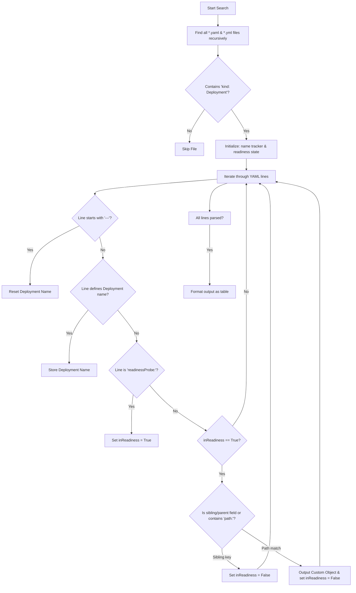

# Kubernetes Readiness Probe Extractor

A PowerShell script to recursively discover, parse, and audit **Kubernetes Deployment** YAML/YML configurations to extract their configured **Readiness Probe HTTP paths**. 

This tool is highly valuable for DevOps engineers and SREs to perform quick audits of microservice health check endpoints, verify ingress configurations, or ensure compliance with standard health check routes across a large codebase.

---

## 🌟 Features

- **Recursive Scanning**: Automatically scans the current directory and all subdirectories for `.yaml` and `.yml` files.
- **Smart Filtering**: Specifically target files that define a Kubernetes `Deployment`.
- **Multi-Document Support**: Correctly handles multi-document YAML files (separated by `---`) by resetting the deployment name tracker.
- **Heuristic Probe Boundary Parsing**: Uses a state-machine parser to scan lines inside the `readinessProbe:` block and exits safely if a sibling or outer-level property is encountered.
- **Parameter Support**: Custom target directories can be specified via the `-Path` parameter.
- **Clean Tabular Output**: Outputs structured PowerShell Custom Objects formatted as an auto-sized table.

---

## ⚙️ How It Works

Here is a step-by-step breakdown of the script's internal logic:



### Key Logic Segments

1. **State Machine (`inReadiness` & `deploymentName`)**:
   Since parsing raw YAML using regex can be tricky due to indentation, the script behaves as a state machine. Once it encounters `readinessProbe:`, it enters the readiness probe context.
   
2. **Indentation/Context Bound Exit**:
   ```powershell
   if ($line -match "^\s{0,6}[a-zA-Z]") { $inReadiness = $false }
   ```
   If a line matches a normal alphabetical key at a shallow indentation level (0 to 6 spaces), it signifies that the parser has exited the `readinessProbe` block and is processing a different section. The script then resets the context to avoid misattributing subsequent paths.

3. **Multi-Document Reset**:
   ```powershell
   if ($line -match "^---") { $deploymentName = "" }
   ```
   Ensures that if multiple Kubernetes manifests are combined in a single file, the name of a previous manifest is not erroneously associated with a later deployment.

---

## 🚀 Usage

### Prerequisites
- Windows PowerShell or PowerShell Core (installed on Windows, macOS, or Linux).

### Running the Script

1. **Run in the Current Directory**:
   To scan files in the folder you are currently in:
   ```powershell
   .\get-readiness-probes.ps1
   ```

2. **Scan a Specific Directory**:
   You can specify a target directory using the `-Path` parameter:
   ```powershell
   .\get-readiness-probes.ps1 -Path "D:\Workplace\kubernetes-configs"
   ```

### Example Output

When run against a directory containing deployment configurations, the script produces a clean, structured table like this:

```text
Folder             Deployment                 Readiness Path
------             ----------                 --------------
auth-service       user-auth-deployment       /actuator/health/readiness
payment-gateway    stripe-connector           /healthz
web-portal         frontend-app               /
```

---

## 🛠️ Customization

If you want to extract other types of probes, such as **livenessProbes** or **startupProbes**, you can easily modify the target matches in the script:
- Change `"readinessProbe:"` to `"livenessProbe:"` or `"startupProbe:"`.
- Keep the rest of the extraction flow intact.
