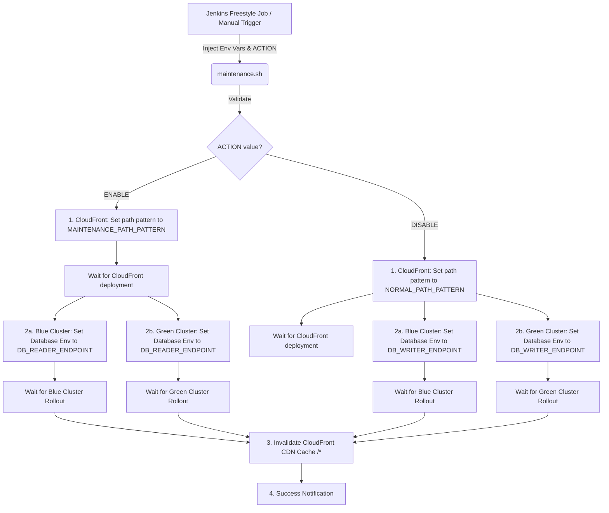

# K8s & CloudFront Maintenance Mode Orchestrator

A production-ready solution to seamlessly toggle maintenance mode for applications running on Kubernetes across **Blue and Green clusters** and served through AWS CloudFront.

This folder contains a shell orchestrator (`maintenance.sh`) designed for use inside continuous integration pipelines (specifically configured as a **Jenkins Freestyle Job**) to control maintenance transitions with zero downtime and instant cache invalidations.

---

## 🏗️ Architecture & Flow Overview



### 1. CloudFront Routing Toggle (Precedence 0 Behavior)
To serve a maintenance page:
- **During normal operation:** A custom cache behavior with path pattern `/down` maps traffic to a static S3 bucket origin hosting the maintenance page. Dynamic traffic `*` flows to the live application load balancer.
- **During maintenance mode:** The script modifies the `/down` behavior's path pattern to `*`. This overrides other behaviors (since it is at precedence 0) and instantly routes all user traffic to the maintenance bucket.

Since **AWS CloudFront is a global service**, the script manages the CDN configuration without requiring regional endpoint specifications (`--region`), relying instead on standard global API endpoints.

### 2. Blue/Green Database Environment Toggle
During maintenance, active transactional writes should be avoided to prevent corrupt data state or allow database updates:
- **ENABLE Maintenance:** The script patches the target environment variable (e.g., `DATABASE_URL`) from the `writer` endpoint to the `reader` endpoint (or to a read-only state) across **both Blue and Green Kubernetes clusters** using their respective context names.
- **DISABLE Maintenance:** The script patches the environment variable back to the `writer` endpoint in both clusters, allowing full write capabilities.

---

## 🛠️ File Structure

* [maintenance.sh](file:///d:/Workplace/GitHub/devops-tools/maintenance-mode/maintenance.sh): The main orchestrator script using `set -euo pipefail`, ANSI colors, CLI checks, multi-cluster context switching, and robust ERR traps.

---

## 📋 Pre-requisites & AWS Configuration

To ensure successful execution, your AWS and Kubernetes architectures must be prepared accordingly:

### AWS CloudFront Setup
1. Your CloudFront distribution must have a Cache Behavior configured at **precedence 0** (the very top of the list, above the default behavior).
2. The initial Path Pattern for this precedence 0 behavior must be `/down`.
3. The origin for this cache behavior should point to the S3 bucket hosting your static maintenance assets (e.g. `index.html`, assets).

### Kubernetes Configuration & Multi-Cluster Context
The Jenkins executor running `kubectl` must have a `kubeconfig` loaded that contains context mappings for both target Kubernetes clusters:
* **Blue Cluster Context Name:** `blue-cluster-context`
* **Green Cluster Context Name:** `green-cluster-context`

The script uses `kubectl --context="context-name"` to target the deployments individually.

### Tools Required on Execution Agent
The script automatically validates the presence of the following tools:
* `aws` (AWS CLI v2 recommended)
* `kubectl` (configured with correct cluster context)
* `jq` (JSON parser tool)

---

## ⚙️ Configuration

For simplicity and ease of use in a standard Jenkins Freestyle Job, all configuration values are directly hardcoded inside the `maintenance.sh` script. The only input required from the Jenkins execution environment is the `ACTION` parameter.

### Hardcoded Configuration Settings

* **CloudFront Distribution ID (`CLOUDFRONT_DISTRIBUTION_ID`):** `E1234567890ABC`
* **Target Environment Variable (`ENV_VAR_NAME`):** `DATABASE_URL`
* **Maintenance Path Pattern (`MAINTENANCE_PATH_PATTERN`):** `*`
* **Normal Path Pattern (`NORMAL_PATH_PATTERN`):** `/down`
* **DB Reader Endpoint (`DB_READER_ENDPOINT`):** `jdbc:postgresql://reader:5432/postgres?ssl=true&sslmode=require`
* **DB Writer Endpoint (`DB_WRITER_ENDPOINT`):** `jdbc:postgresql://writer:5432/postgres?ssl=true&sslmode=require`

#### 📦 Blue Cluster Settings
* **Blue Cluster Context (`K8S_CLUSTER_BLUE_CONTEXT`):** `blue-cluster-context`
* **Blue Cluster Namespace (`K8S_NAMESPACE_BLUE`):** `production`
* **Blue Cluster Deployment (`K8S_DEPLOYMENT_BLUE_NAME`):** `my-app-deployment`

#### 📦 Green Cluster Settings
* **Green Cluster Context (`K8S_CLUSTER_GREEN_CONTEXT`):** `green-cluster-context`
* **Green Cluster Namespace (`K8S_NAMESPACE_GREEN`):** `production`
* **Green Cluster Deployment (`K8S_DEPLOYMENT_GREEN_NAME`):** `my-other-app-deployment`

> [!TIP]
> If you ever need to adjust these values in the future, you can edit them directly in the **Configuration (Hardcoded Settings)** section at the top of the [maintenance.sh](file:///d:/Workplace/GitHub/devops-tools/maintenance-mode/maintenance.sh) file.

---

## ⚓ Jenkins Freestyle Job Setup Guide

To run this script in a Jenkins Freestyle Job, configure the following sections in your job's configuration UI:

### 1. General Configuration
Check **"This project is parameterized"** and add only the following parameter:

* **Choice Parameter**:
  - **Name:** `ACTION`
  - **Choices:**
    ```text
    ENABLE
    DISABLE
    ```
  - **Description:** Toggle Maintenance Mode on/off.

> [!NOTE]
> All other variables (contexts, namespaces, deployments) are configured with default/sample values directly inside `maintenance.sh`. You do not need to add them as parameters in Jenkins unless you want to override them.

### 2. Build Environment (Credentials Binding)
You must bind your AWS credentials and Kubernetes `kubeconfig` (which contains access details for both clusters) so they are available in the script's environment:

1. Check **"Use secret text(s) or file(s)"** (provided by the *Credentials Binding* plugin).
2. **AWS Credentials Binding**:
   - Add a binding for **AWS Access Key ID and Secret Access Key** (or use standard AWS credentials wrapper).
   - Set the variables to `AWS_ACCESS_KEY_ID` and `AWS_SECRET_ACCESS_KEY`.
3. **Kubernetes Credentials Binding**:
   - Add a binding of type **Secret file** (containing your multi-cluster `kubeconfig` content).
   - Set the variable name to: `KUBECONFIG`.

### 3. Build Steps
Add a build step **"Execute shell"** and input the following commands:

```bash
# Make the orchestrator executable
chmod +x ./maintenance-mode/maintenance.sh

# Execute the script
./maintenance-mode/maintenance.sh
```

---

## 🚀 Running the Script Locally

You can test the script locally by exporting the `ACTION` variable and executing `maintenance.sh`:

```bash
# 1. Export Action
export ACTION="ENABLE"

# 2. Make the script executable
chmod +x ./maintenance.sh

# 3. Execute
./maintenance.sh
```
